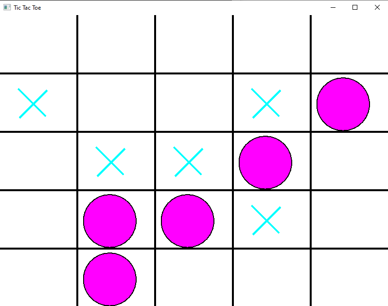

# Tic Tac Toe with AI
You can adjust maxDepth in GameGUI.cpp. \
The higher the depth is the stronger bot is.
# Implemntation of AI
AI is implemented using minimax algorithm with alfa-beta pruning.

# GUI
Right mouse button - letting AI start the game \
Left mouse button - you are starting the game

# Configuration enviroment
Project is using SFML libraries. Tutorial: 
https://www.sfml-dev.org/tutorials/2.6/